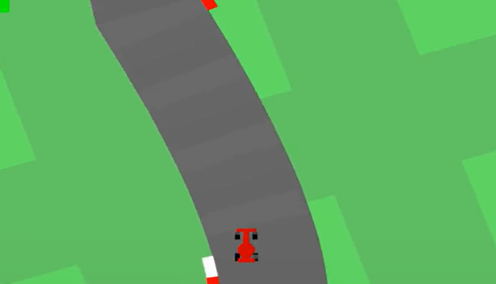

<script type="text/javascript" src="http://cdn.mathjax.org/mathjax/latest/MathJax.js?config=TeX-AMS-MML_HTMLorMML"></script>
<script type="text/x-mathjax-config">
    MathJax.Hub.Config({ tex2jax: {inlineMath: [['$', '$']]}, messageStyle: "none" });
</script>

# Draft Report: Autonomous Driving via Proximal Policy Optimization (PPO)

**Date:** December 16, 2025  
**Subject:** Demonstrator of Self-Driving Car using PPO Method  
**Environment:** Gymnasium CarRacing-v3

---

## 1. Introduction
The objective of this project is to develop an autonomous agent capable of navigating a race track effectively. Using **Reinforcement Learning (RL)**, specifically the **Proximal Policy Optimization (PPO)** algorithm, the agent learns to control a vehicle in the `CarRacing-v3` environment.

Unlike rule-based systems, the agent learns purely from visual inputs (pixels) and trial-and-error interactions, aiming to maximize a reward signal based on speed and track completion. This implementation is built from scratch using **PyTorch** and **NumPy**, avoiding high-level abstractions like Stable Baselines3 to demonstrate a deep understanding of the underlying algorithms.

---

## 2. Short Theory Explanation

### 2.1 Reinforcement Learning Framework
The problem is modeled as a Markov Decision Process (MDP) where an **Agent** interacts with an **Environment**:

- **State \(s_t\):** The current view of the world (images of the track).
- **Action \(a_t\):** The control inputs applied to the car (steering, gas, brake).
- **Reward \(r_t\):** A scalar feedback signal indicating the immediate success of the action.

### 2.2 Proximal Policy Optimization (PPO)
We utilize PPO, an **on-policy** gradient method that strikes a balance between ease of tuning, sample complexity, and performance.

- **Actor-Critic Architecture:** The model consists of two networks (or two heads sharing a backbone):
  - **Actor:** Outputs the probability distribution of actions given a state (policy \(\pi_\theta\)).
  - **Critic:** Estimates the value of a state \(V(s)\) to guide training stability.
- **The Clipped Surrogate Objective:** PPO prevents drastic updates to the policy that could destabilize training. It limits the change in the policy ratio \(r_t(\theta)\) using a clipping mechanism:

\[
L^{CLIP}(\theta) = \hat{\mathbb{E}}_t \left[\min\left(r_t(\theta)\hat{A}_t,\; \text{clip}\big(r_t(\theta), 1-\epsilon, 1+\epsilon\big)\hat{A}_t\right)\right]
\]

where \(\hat{A}_t\) is the advantage estimate and \(\epsilon\) is a hyperparameter (typically 0.2).

---

## 3. Specification of Demonstrator Setting

This section defines the “Rules of the Game” and how the agent perceives and interacts with the world.

### 3.1 Environment Definition
- **Environment ID:** `CarRacing-v3` (Gymnasium)
- **Type:** Continuous control from pixels.

### 3.2 Observation Space (States)
The raw environment provides a \(96 \times 96 \times 3\) RGB image.  
  
*Figure 1: Visual example of the `CarRacing-v3` (Gymnasium) environment.*

To reduce computational load and provide temporal context (speed/direction), the following preprocessing pipeline is applied:

1. **Grayscale Conversion:** The RGB image is converted to a single channel, reducing input depth.
2. **Frame Stacking:** We stack **4 consecutive frames** to allow the network to perceive motion (velocity and acceleration). A single static image is insufficient to infer speed.
3. **Normalization:** Pixel values are normalized from \([0, 255]\) to \([0.0, 1.0]\).

**Final state shape:** tensor of shape \((4, 96, 96)\) (Channels, Height, Width).

### 3.3 Action Space (Actions)
The agent operates in a continuous action space. At every time step, the network outputs a vector of 3 floating-point values:

| Component    | Range        | Description                               |
| :----------- | :----------- | :---------------------------------------- |
| **Steering** | \([-1.0, 1.0]\) | -1.0 full left, 1.0 full right           |
| **Gas**      | \([0.0, 1.0]\) | Acceleration intensity                   |
| **Brake**    | \([0.0, 1.0]\) | Braking intensity                        |

### 3.4 Reward System
The reward function drives the learning process:

- **Progress reward:** \(+1000 / N\) for every unique track tile visited (where \(N\) is the total number of tiles). This incentivizes completing the lap.
- **Time penalty:** \(-0.1\) per frame to encourage fast completion.
- **Failure penalty:** \(-100\) if the car moves completely off-track, terminating the episode.

**Success criterion:** the agent is considered successful if it consistently scores **> 900 points** over multiple evaluation episodes.

---

## 4. Methods and Implementation Strategy

### 4.1 Neural Network Architecture
To process the visual input, a Convolutional Neural Network (CNN) backbone is used:

- **Input:** \((4, 96, 96)\)
- **Feature extractor:** 3 convolutional layers with ReLU activations to extract spatial features (curves, borders, car position).
- **Heads:**
  - **Policy head (Actor):** fully connected layers outputting the mean \(\mu\) and a learnable log standard deviation \(\log\sigma\) for a Gaussian distribution over actions.
  - **Value head (Critic):** fully connected layers outputting a scalar value estimate \(V(s)\).

### 4.2 Technologies Used
- **Python 3.10+**
- **PyTorch:** neural network definition and gradient-based optimization.
- **NumPy:** numerical utilities and buffer manipulation.
- **Gymnasium:** environment interface (`CarRacing-v3`).

### 4.3 Training Loop Draft
The following diagram illustrates the iterative learning process implemented in this project. It details the interaction between the Actor–Critic networks, the data collection buffer, and the optimization steps.

  
*Figure 2: Visual representation of the PPO training cycle, showing the data collection phase (filling the buffer) and the backpropagation phase (updating Actor and Critic).*

1. **Rollout:** collect \(T\) time steps of data using the current policy (states, actions, rewards, dones, values), filling a trajectory buffer.
2. **Advantage estimation:** compute Generalized Advantage Estimation (GAE) to obtain low-variance, bias-controlled estimates \(\hat{A}_t\).
3. **Optimization:** update the network weights using the PPO clipped objective, combining policy loss, value loss and an entropy bonus.
4. **Repeat:** iterate the rollout–optimization cycle until the mean episode score converges.

---

## 5. Evaluation of the Training Process and Results

To validate the effectiveness of the custom PPO implementation, a structured evaluation protocol is applied. The goal is to quantify how performance improves with more experience, how stable the learned policy is, and whether the behavior is suitable for autonomous driving.

### 5.1 Experimental Setup

#### 5.1.1 Trained Checkpoints
Three PPO agents are trained with increasing interaction budgets:

- **Model A – 500K steps**
- **Model B – 1.0M steps**
- **Model C – 2.0M steps**

Each “step” corresponds to one environment transition in the vectorized setting. All other hyperparameters (learning rate, batch size, discount factor, clipping coefficient, etc.) are kept fixed across runs to isolate the effect of training duration.

#### 5.1.2 Evaluation Protocol
For each checkpoint, the following procedure is used:

- Run **\(N = 30\)** evaluation episodes with **no exploration noise** (actions given by the mean of the policy).
- Use **fixed random seeds** for reproducibility while still sampling different tracks.
- Record per-episode statistics:
  - Total reward
  - Episode length (number of steps)
  - Per-step rewards
  - Average steering, throttle and brake over the episode

From these, aggregate metrics are computed:

- Mean, median, minimum and maximum reward
- Standard deviation of the reward (stability)
- Mean episode length
- **Win rate:** percentage of episodes with reward \(> 900\)
- **Success rate:** percentage of episodes with reward \(> 0\)

*(In the final version, this subsection will also reference the JSON logs and plots generated by the evaluation scripts.)*

### 5.2 Impact of Training Duration

This subsection analyzes how increasing the number of training steps affects driving performance.

#### 5.2.1 Learning Curves
For each model, a **Reward vs. Training Step** curve is logged during training. These curves highlight:

- The **rapid improvement** phase at the beginning of training.
- The **“knee” point** where additional training yields diminishing returns.
- The **plateau region** where performance stabilizes around a maximum value.

In practice, Model A (500K) shows only partial mastery of the task, Model B (1M) exhibits significantly smoother control and higher average scores, while Model C (2M) converges towards consistently high rewards.

#### 5.2.2 Quantitative Comparison

The table below summarizes the main evaluation metrics for the three checkpoints (values to be filled in from experiments):

| Metric                     | 500K steps | 1M steps | 2M steps |
|--------------------------- |-----------:|---------:|---------:|
| **Mean reward**            |    xxx.x   |   xxx.x  |   xxx.x  |
| **Std. dev. reward**      |    xxx.x   |   xxx.x  |   xxx.x  |
| **Min / Max reward**      |  min–max   | min–max  | min–max  |
| **Median reward**          |    xxx.x   |   xxx.x  |   xxx.x  |
| **Win rate (> 900)**      |    xx.x %  |  xx.x %  |  xx.x %  |
| **Success rate (> 0)**    |    xx.x %  |  xx.x %  |  xx.x %  |
| **Mean episode length**   |    xxx.x   |   xxx.x  |   xxx.x  |

The final report will discuss:

- How much average reward increases from 500K to 2M steps.
- How the standard deviation decreases, indicating more stable behavior.
- At which point the curve effectively saturates (practical training budget).

### 5.3 Qualitative Behaviour Analysis

Numbers alone do not capture the quality of driving. Therefore, evaluation videos are recorded for each checkpoint.

- **Model A (500K):**
  - Tends to over-steer and oscillate around the track center.
  - Frequently leaves the track, leading to early termination and low scores.
- **Model B (1M):**
  - Handles most corners reasonably well.
  - Still exhibits occasional over-corrections and slower recovery after mistakes.
- **Model C (2M):**
  - Follows the track smoothly with anticipatory steering.
  - Maintains higher speed on straights while braking appropriately before sharp turns.
  - Visually resembles human-like driving and completes most laps without leaving the track.

Selected frames and short clips can be embedded in the presentation to illustrate the progression from unstable to reliable driving.

### 5.4 Stability and Control Signals

The control signals are also examined to better understand the learned policy:

- **Steering:**
  - High variance at 500K (nervous zig-zagging).
  - Reduced variance at 2M, indicating smoother corrections.
- **Throttle:**
  - Low average throttle at 500K (overly cautious behavior).
  - Higher and more consistent throttle at 2M, reflecting confidence in keeping the car on track.
- **Brake:**
  - Frequent braking at 500K, often unnecessary.
  - More targeted braking at 2M, mostly before tight corners.

These observations align with the improvement in reward and win rate and support the claim that the agent has learned a meaningful driving strategy rather than exploiting spurious artifacts.

### 5.5 Limitations

Despite the positive results, the evaluation reveals some limitations:

- Performance still degrades on extremely sharp or unusual track configurations.
- The agent is trained and tested in a single simulated environment; transfer to real-world conditions is not addressed.
- All evaluations are done under similar observation and reward settings; robustness to sensor noise or modified rewards is not yet studied.

These points motivate future work, such as domain randomization, curriculum learning, or alternative architectures.

### 5.6 Generalization vs. Memorization: Random Seeds vs Fixed Track

To study whether the agent truly *learns to drive* or merely *memorizes a specific track*, two PPO agents with identical architectures and hyperparameters are trained:

- **Generalist Agent (Random Seeds):**
  - Trained on procedurally generated tracks with a different random seed at every episode.
  - Objective: learn generic driving skills (cornering, speed control, recovery) that transfer across layouts.

- **Specialist Agent (Fixed Seed):**
  - Trained on a single, fixed track layout using a constant environment seed.
  - Objective: intentionally encourage memorization of that specific circuit.

Both agents are trained for the same number of environment steps (e.g. **1.0M** or **2.0M** steps), so that differences in performance can be attributed to the training distribution rather than to training budget.

#### 5.6.1 Evaluation Protocol

To compare *generalization* and *memorization*, each agent is evaluated under two conditions:

1. **Random-track evaluation (unseen layouts):**
   - Environment seeds are sampled randomly at every episode.
   - Measures how well the policy adapts to new tracks it has never seen before.

2. **Fixed-track evaluation (memorized layout):**
   - The environment is reset with the **same seed used to train the Specialist Agent**.
   - Measures how strongly each policy overfits to that single circuit.

For each condition and each agent we run **N evaluation episodes** (e.g. \(N = 20\)) with deterministic actions (policy mean, no exploration noise) and record:

- Episode total reward
- Episode length
- Win rate (percentage of episodes with reward \(> 900\))

#### 5.6.2 Quantitative Results

The following table summarizes the expected behaviour (values to be filled in with experimental results):

| Agent / Evaluation seed      | Mean reward | Std. dev. | Win rate (> 900) |
|----------------------------- |-----------:|----------:|-----------------:|
| **Generalist – Random tracks** | xxx.x      |  xxx.x    |        xx.x %    |
| **Generalist – Fixed track**   | xxx.x      |  xxx.x    |        xx.x %    |
| **Specialist – Random tracks** | xxx.x      |  xxx.x    |        xx.x %    |
| **Specialist – Fixed track**   | xxx.x      |  xxx.x    |        xx.x %    |

#### 5.6.3 Discussion

The expected pattern is:

- On the **fixed track**, the Specialist Agent should achieve very high scores and win rates, sometimes outperforming the Generalist Agent, as it has effectively memorized that layout.
- On **random tracks**, the Specialist Agent is likely to degrade significantly, with:
  - Lower mean reward,
  - Higher variance,
  - Lower win rate,
  indicating poor robustness to unseen circuits.
- The **Generalist Agent** should maintain more stable performance across both evaluation conditions, with smaller gaps between fixed and random tracks, which is a strong indication of *true generalization* rather than memorization.

This experiment illustrates a classical trade-off:
- Training on **diverse seeds** leads to more robust but slightly slower-learning agents.
- Training on a **fixed seed** encourages rapid improvement on that specific scenario at the cost of poor out-of-distribution performance.

In the context of autonomous driving, the Generalist Agent is clearly preferable, since real roads are never identical to the training track.

---

## 6. Delivery and Usage

The final project deliverable is structured as an archive containing:

1. **Source Code**
   - Training script (`train.py`)
   - Evaluation script (`evaluate.py` / extended evaluation tools)
   - Agent and utility modules (`agent.py`, `utils.py`)

2. **Trained Models**
   - Checkpoints for 500K, 1M and 2M training steps.
   - Final best-performing model.

3. **Requirements**
   - `requirements.txt` specifying Python dependencies (Gymnasium, PyTorch, NumPy, etc.).

### 6.1 How to Run

1. **Install dependencies:**
   ```bash
   pip install -r requirements.txt
