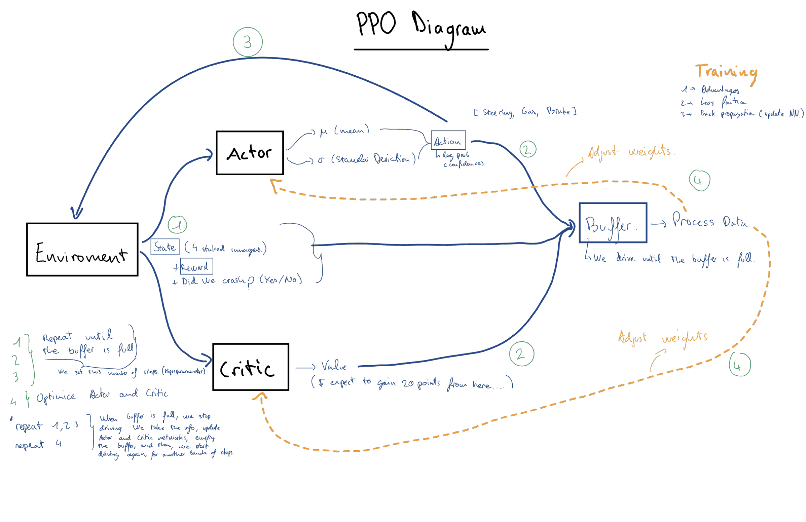

# Draft Report: Autonomous Driving via Proximal Policy Optimization (PPO)

**Date:** December 16, 2025
**Subject:** Demonstrator of Self-Driving Car using PPO Method
**Environment:** Gymnasium CarRacing-v3

---

## 1. Introduction
The objective of this project is to develop an autonomous agent capable of navigating a race track effectively. Using **Reinforcement Learning (RL)**, specifically the **Proximal Policy Optimization (PPO)** algorithm, the agent learns to control a vehicle in the `CarRacing-v3` environment.

Unlike rule-based systems, the agent learns purely from visual inputs (pixels) and trial-and-error interactions, aiming to maximize a reward signal based on speed and track completion. This implementation is built from scratch using **PyTorch** and **NumPy**, avoiding high-level abstractions like Stable Baselines3 to demonstrate a deep understanding of the underlying algorithms.

---

## 2. Short Theory Explanation

### 2.1 Reinforcement Learning Framework
The problem is modeled as a Markov Decision Process (MDP) where an **Agent** interacts with an **Environment**:
* **State ($s_t$):** The current view of the world (images of the track).
* **Action ($a_t$):** The control inputs applied to the car (steering, gas, brake).
* **Reward ($r_t$):** A scalar feedback signal indicating the immediate success of the action.

### 2.2 Proximal Policy Optimization (PPO)
We utilize PPO, an **on-policy** gradient method that strikes a balance between ease of tuning, sample complexity, and performance.

* **Actor-Critic Architecture:** The model consists of two networks (or two heads sharing a backbone):
    * **Actor:** Outputs the probability distribution of actions given a state (Policy $\pi_\theta$).
    * **Critic:** Estimates the value of a state ($V(s)$) to guide the training stability.
* **The Clipped Surrogate Objective:** PPO prevents drastic updates to the policy that could destabilize training. It limits the change in the policy ratio $r_t(\theta)$ using a clipping mechanism:
    $$L^{CLIP}(\theta) = \hat{\mathbb{E}}_t [\min(r_t(\theta)\hat{A}_t, \text{clip}(r_t(\theta), 1-\epsilon, 1+\epsilon)\hat{A}_t)]$$
    Where $\hat{A}_t$ is the advantage estimate and $\epsilon$ is a hyperparameter (usually 0.2).

---

## 3. Specification of Demonstrator Setting

This section defines the "Rules of the Game" and how the agent perceives and interacts with the world, satisfying the deadline requirement for defining actions and states.

### 3.1 Environment Definition
* **Environment ID:** `CarRacing-v3` (Gymnasium)
* **Type:** Continuous Control from Pixels.

### 3.2 Observation Space (States)
The raw environment provides a $96 \times 96 \times 3$ RGB image. To reduce computational load and provide temporal context (speed/direction), we apply the following preprocessing pipeline:

1.  **Grayscale Conversion:** The RGB image is converted to a single channel, reducing input depth.
2.  **Frame Stacking:** We stack **4 consecutive frames** to allow the network to perceive motion (velocity and acceleration). A single static image is insufficient for inferring speed.
3.  **Normalization:** Pixel values are normalized from $[0, 255]$ to $[0.0, 1.0]$.

**Final State Shape:** A Tensor of shape `(4, 96, 96)` (Channels, Height, Width).

### 3.3 Action Space (Actions)
The agent operates in a continuous action space. At every time step, the network outputs a vector of 3 floating-point values:

| Component | Range | Description |
| :--- | :--- | :--- |
| **Steering** | $[-1.0, 1.0]$ | -1.0 is full Left, 1.0 is full Right. |
| **Gas** | $[0.0, 1.0]$ | Acceleration intensity. |
| **Brake** | $[0.0, 1.0]$ | Braking intensity. |

### 3.4 Reward System
The reward function drives the learning process:
* **Progress Reward:** $+1000 / N$ for every unique track tile visited (where $N$ is the total tiles). This incentivizes completing the lap.
* **Time Penalty:** $-0.1$ per frame. This incentivizes the agent to drive fast to minimize the total negative reward accumulation.
* **Failure Penalty:** $-100$ if the car moves completely off-track, terminating the episode immediately.

**Success Metric:** The model is considered successful if it consistently scores **> 900 points**.

---

## 4. Methods and Implementation Strategy

### 4.1 Neural Network Architecture
To process the visual input, we use a Convolutional Neural Network (CNN) backbone:
* **Input:** $(4, 96, 96)$
* **Feature Extractor:** 3 Convolutional layers with ReLU activation to extract spatial features (curves, borders, car position).
* **Heads:**
    * **Policy Head (Actor):** Fully connected layers outputting the mean ($\mu$) and standard deviation ($\sigma$) for the Beta or Gaussian distribution of the actions.
    * **Value Head (Critic):** Fully connected layers outputting a scalar Value estimate ($V$).

### 4.2 Technologies Used
* **Python 3.10+**
* **PyTorch:** For constructing the neural networks and calculating gradients.
* **NumPy:** For math operations and memory buffer management.
* **Gymnasium:** For the environment interface.

### 4.3 Training Loop Draft
The following diagram illustrates the iterative learning process implemented in our project. It details the interaction between the Actor-Critic networks, the data collection buffer, and the optimization steps.

*Figure 1: Visual representation of the PPO training cycl, showing the data collection phase (filling the buffer) and the backpropagation phase (updating Actor and Critic).*

1.  **Rollout:** Collect $T$ timesteps of data using the current policy (filling the buffer with States, Actions, and Rewards).
2.  **Advantage Estimation:** Calculate Generalized Advantage Estimation (GAE) to reduce variance.
3.  **Optimization:** Update the network weights using Stochastic Gradient Descent (SGD) or Adam optimizer on the PPO loss function.
4.  **Repeat:** Iterate until the average score stabilizes above 900.